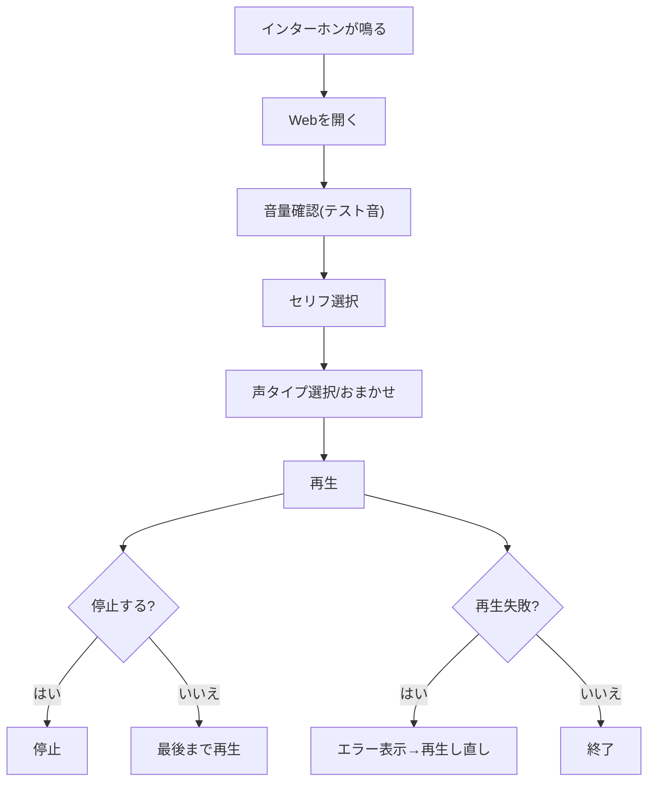

# 要求定義書（推奨保存名: 02_要求定義_男性の声で防犯_20260207.md）

## 1. 目的と背景
- 目的: 一人暮らしの女性が配達対応時に「女性がいる」とバレる不安を減らす。
- 背景: 既存アプリは声色が単一で、繰り返し利用時にバレる可能性があるため、複数声色・口調で差別化する。

## 2. ゴール（成功基準）
1. 配達員に「男性がいる」と思わせられたとユーザーが感じる。
2. インターホン越しに1タップで再生できる。
3. 同じユーザーが繰り返し使ってもパターンがバレにくい。

## 3. 対象ユーザーと利用シーン
- 対象ユーザー: 一人暮らしの女性
- 主利用シーン: 配達対応（インターホン越し）
- 利用頻度: 週に数回

## 4. スコープと公開方針
- MVPプラットフォーム: スマホWeb（iPhone/Androidのブラウザ）
- 将来: iPhoneアプリ
- ログイン: 不要
- オフライン: 不要（オンライン前提）
- 収益化: MVPは無し、将来はWeb広告／アプリ買い切り＋広告
- 目標公開時期: 1週間以内（目標: 2026-02-14）

## 5. 差別化ポイント
1. 若めの声に絞って、口調の差で使い分けできる。
2. セリフ×声タイプの組み合わせで繰り返し利用でもバレにくい。
3. おまかせ機能で声タイプを自動で変えられる。
4. スマホWebで即利用可能（アプリDL不要）。

## 6. 市場調査（日本）

### 6-1. 想定ユーザー数（推計）
- 日本の総世帯数は約5,570万世帯（2020年）。
- 単独世帯は全体の38.1%（2020年）。
- 上記より単独世帯数は約2,120万世帯（推計: 5,570万 × 0.381）。
- スマホでのインターネット利用率は74.4%（2024年、個人ベース）。
- スマホ到達可能な単独世帯は約1,580万世帯（推計: 2,120万 × 0.744）。
- 女性比率は公式データで別途確認が必要。暫定的に40〜60%を想定すると、
  女性単独世帯（スマホ到達可能）は約630万〜950万世帯（推計）。
- 初期SOM（0.1〜1%）: 約6,000〜95,000ユーザー。

### 6-2. 競合状況（日本のアプリ例）
- 競合A: 「１人暮らしの女性に便利な男性の声素材集」
  - 男性の定型フレーズを再生する素材集タイプ。
- 競合B: 「男性応答アプリ 防犯」
  - 男性音声のTTS、話速調整、オフライン対応など。
- 競合C: 「コエマモ 防犯アプリ」
  - 男性音声＋防犯ブザー・フェイク通話等の複合型。

差別化の方向性:
- 声色・口調のバリエーションを中心に、短時間で再生できる導線を最適化する。

### 6-3. 想定ユーザーデモグラ（仮説）
- 主ターゲット: 20〜40代の都市部・一人暮らし女性
- 根拠補助: スマホ利用率は13〜59歳で80%以上の水準
- サブターゲット: 高齢の一人暮らし女性（操作の簡単さ重視）

### 6-4. マネタイズの道筋と金額目標（仮）
- Phase 1（MVP）: 無料で提供。継続率と利用頻度の検証を優先。
- Phase 2（Web広告）: MAUが一定規模に達したらバナー/インタースティシャル導入。
- Phase 3（有料アプリ）: 声パック追加、買い切り＋広告のハイブリッド。
- Phase 4（UGC）: アップロード機能導入＋審査体制構築。収益分配で供給を拡張。

金額目標（仮）:
- 3〜6か月: 広告売上 月5〜10万円 or 有料DL 1,000件（¥500）で50万円
- 12か月: 広告売上 月30〜50万円 or 有料DL 5,000件（¥500）で250万円
- 24か月: 広告売上 月100万円 or 有料DL 20,000件（¥500）で1,000万円

※上記は仮の目標値。広告RPM・CVR・継続率の実測に基づき再計算する。

## 7. コンテンツ要件（MVP）
1. セリフ: 5種類
2. セリフ例: 「はい」「はーい」「ありがとうございます」「玄関の前に置いといてください」「少し待ってください」
3. 声タイプ: 2種類（すべて標準語）
4. 声タイプ一覧: 若め（丁寧）、若め（少し素っ気ない）
5. セリフ×声タイプの組み合わせ: 10本

## 8. 機能要件（MVP）
1. セリフ選択（5種類）
2. 声タイプ選択（2種類）
3. 声タイプ「おまかせ」選択
4. おまかせ挙動: アプリを開いている間は固定、次回起動時に再抽選
5. 再生ボタン: 1タップで開始
6. 停止ボタン: 途中停止可能
7. セリフ横に「再生」ボタンを配置し、即再生できる
8. 音量確認: 音量バー表示＋テスト音再生＋「音量OK」確認
9. 前回のセリフ・声タイプを起動時に自動選択
10. エラー表示（再生失敗時の簡易通知）
11. 端末スピーカーから再生

## 9. 将来機能（後で追加）
1. ユーザーによる音声アップロード
2. AIによる臨機応変な会話
3. 方言変換（位置情報連動）
4. iPhoneアプリ化
5. 収益化（Web広告／アプリ買い切り＋広告）
6. YouTube公開（拡散・集客目的）

## 10. 業務フロー図

## 11. 入出力と処理詳細
- 入力: セリフ選択、声タイプ選択、おまかせ選択、再生、停止
- 処理: 選択内容を反映し対象音声を再生、再生中は停止を受け付ける
- 出力: 男性の音声がスピーカーから再生される
- AI機能（将来）: 入力は配達員の発話または会話意図、出力は自然な男性音声（標準語・敬語優先）としてTBD

## 12. UX設計・設定方法
1. 操作は3ステップ以内で完結（音量確認→セリフ→声タイプ→再生）
2. 再生開始までの遅延目標: 1.0秒以内（仮）
3. セリフ横に再生ボタンを配置して選択と再生を分ける
4. 大きいボタンと明確なラベルで誤操作を防ぐ
5. 起動時に前回設定が選択済み
6. 再生中は停止ボタンを常時表示
7. 声タイプは年齢感と口調が分かる表示名にする
8. スマホ表示でタイトルが大きくなりすぎないよう可変サイズで表示する

## 13. エラー対応方針
1. 再生失敗時: 「再生できませんでした」表示＋再生ボタン
2. 通信エラー時: 「通信エラー」表示＋再試行ボタン
3. 連続失敗時: 簡易ヘルプ表示（例: 通信状態の確認）

## 14. 技術的制約・希望と調査結果
1. Webの音声再生はユーザー操作起点を前提に設計する。
2. iOSのWebでは音量プロパティが操作不可のため、音量バーはテスト音と確認UIで代替する。
3. iOSでサポートされる音声形式を考慮し、音声はMP3またはAACで用意する。
4. 将来UGCを導入する場合は、フィルタリング・通報・ブロック・連絡先公開が必要。

根拠URL:
- https://www.stat.go.jp/english/data/handbook/index.html
- https://apps.apple.com/jp/app/%EF%BC%91%E4%BA%BA%E6%9A%AE%E3%82%89%E3%81%97%E3%81%AE%E5%A5%B3%E6%80%A7%E3%81%AB%E4%BE%BF%E5%88%A9%E3%81%AA%E7%94%B7%E6%80%A7%E3%81%AE%E5%A3%B0%E7%B4%A0%E6%9D%90%E9%9B%86/id1592202644
- https://apps.apple.com/jp/app/%E7%94%B7%E6%80%A7%E5%BF%9C%E7%AD%94%E3%82%A2%E3%83%97%E3%83%AA-%E9%98%B2%E7%8A%AF-%E5%96%B6%E6%A5%AD-%E5%8B%A7%E8%AA%98%E3%82%92%E7%94%B7%E6%80%A7%E3%81%AE%E5%A3%B0%E3%81%A7%E4%B8%81%E5%AF%A7%E3%81%AB%E3%81%8A%E6%96%AD%E3%82%8A/id6752448052
- https://apps.apple.com/jp/app/%E3%82%B3%E3%82%A8%E3%83%9E%E3%83%A2-%E9%98%B2%E7%8A%AF%E3%82%A2%E3%83%97%E3%83%AA/id6566182778
- https://developer.chrome.com/blog/autoplay/
- https://webkit.org/blog/6784/new-video-policies-for-ios/
- https://developer.apple.com/library/archive/documentation/AudioVideo/Conceptual/Using_HTML5_Audio_Video/Device-SpecificConsiderations/Device-SpecificConsiderations.html
- https://developer.apple.com/app-store/review/guidelines/

## 15. 未確定項目（TBD）
1. 女性単独世帯の正確な母数（公的統計の特定）
2. 再生開始遅延の許容値（ms）
3. 収益化開始タイミング
4. UGC時の審査・権利管理フロー
5. 想定トラフィックと運用コスト見積もり

## 16. SEO/公開設定
1. `robots.txt` を配置し、Sitemap の場所を明示
2. `sitemap.xml` を配置し、Search Console から送信
3. canonical URL を設定
4. OGP/Twitter メタを設定
5. JSON-LD（SoftwareApplication）を設置
6. Google Search Console の所有権確認ファイルを配置
7. 使い方ガイドページを追加して内部リンクを強化
8. ブログ記事（2本）を追加して「置き配」「インターホン対応」「男性音声」の検索意図を補強
9. `manifest.json` とアイコンを配置し、ホーム画面追加（A2HS）に対応
